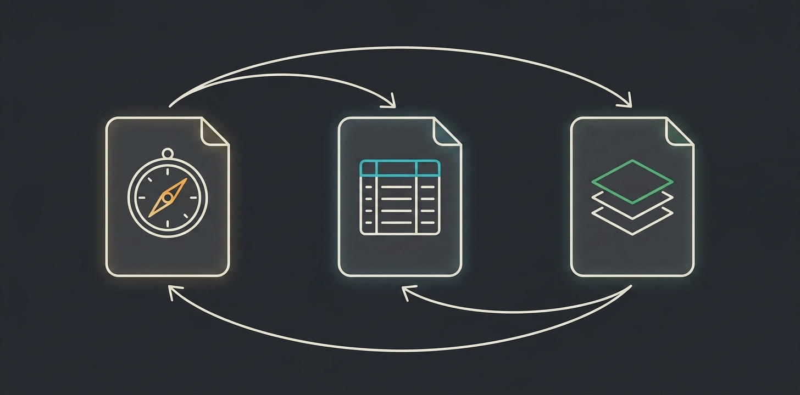
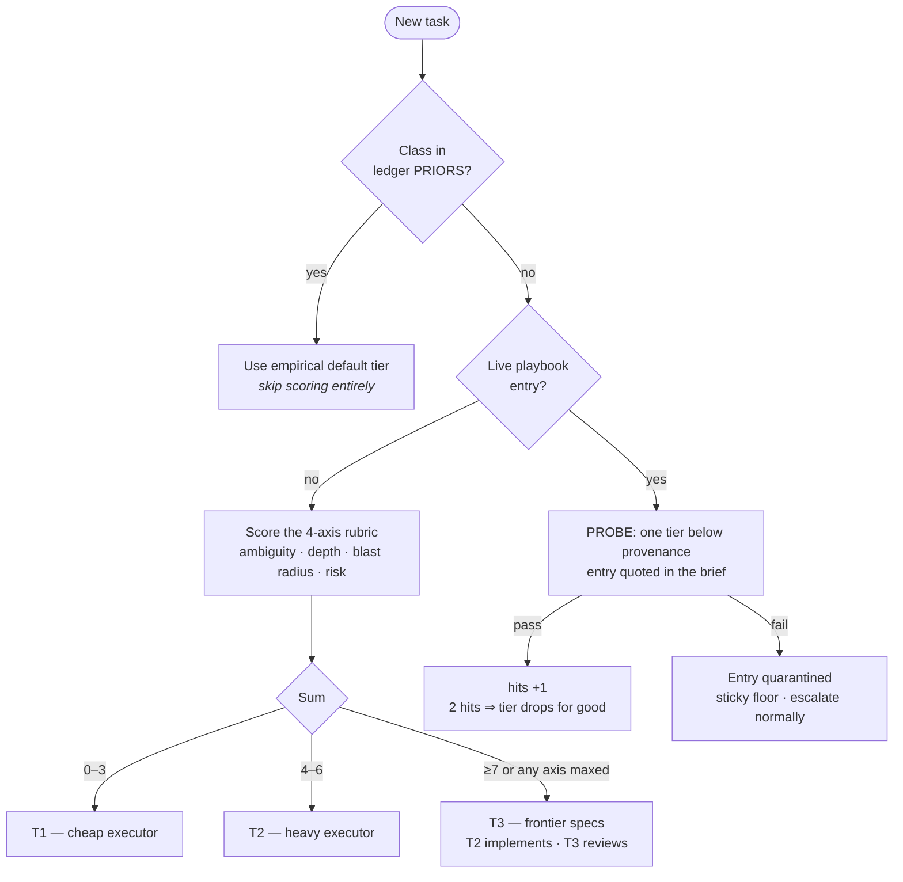
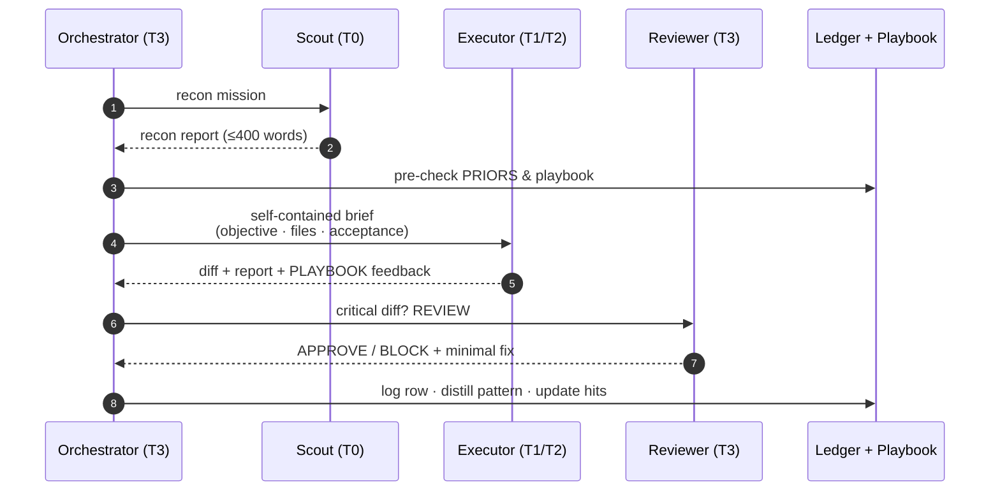
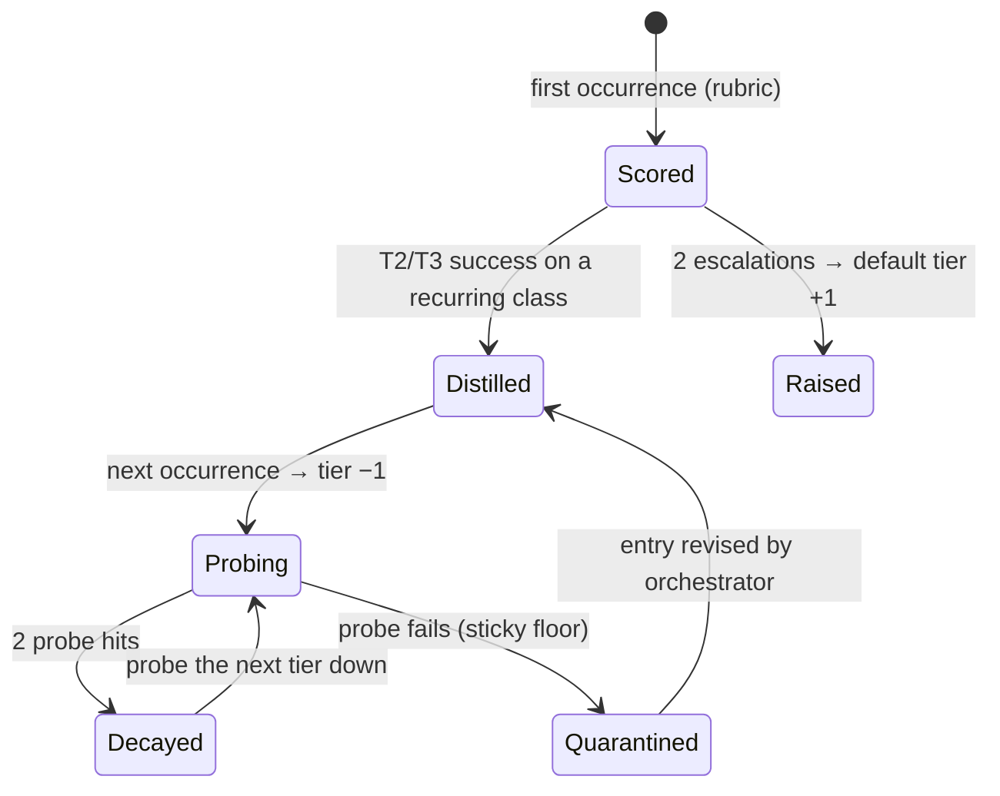
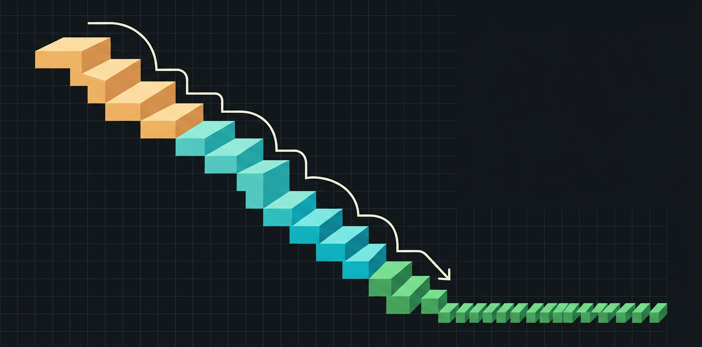

<div align="center">


# TierDecay

**The self-distilling model router for AI coding CLIs. It gets cheaper every run.**

*Solve each problem class at the expensive tier **once**. Execute it at the cheap tier **forever**.*

[](LICENSE)
[](CONTRIBUTING.md)
[](#how-it-works)
[](https://github.com/alebgl77/tierdecay/actions/workflows/ci.yml)
[](https://github.com/alebgl77/tierdecay/stargazers)
<br/>


<br/>


</div>

---

## The problem

Every AI coding CLI forces the same bad trade: burn frontier-model tokens on
boilerplate, or watch a cheap model faceplant on hard problems. Static routing
rubrics help — but a rubric scored by your most expensive model, **on every
task, forever**, is itself the waste. Your router knows nothing about *your*
repo on task 1, and still knows nothing on task 500.

## The idea

**Routing should be a learning system.** TierDecay is three markdown files and
a protocol — no proxy, no daemon, no SDK:

| File | Role | Analogy |
|---|---|---|
| `SPEC` (rubric) | How to route a task you've never seen | Cold-start **prior** |
| `LEDGER` | Predicted vs. executed tier, per task class | Empirical **posterior** |
| `PLAYBOOK` | High-tier solutions compiled into low-tier instructions | **Compilation target** |

<div align="center">

</div>

When an expensive model solves a hard problem, the orchestrator distills the
*decisions* (invariants, ordering, the trap) into a ≤15-line playbook entry.
The next occurrence of that problem class is **probed one tier lower** with
the entry in context. Two hits → the class's default tier drops permanently.
The router literally learns your repo's difficulty distribution.

## How it works

### Routing a task



### One task, end to end



### Life of a problem class



## The economics

Let `n` = future occurrences of a class, `C_hi` / `C_lo` = per-task cost at
the high/low tier.

```
static routing:   n · C_hi
tier decay:       C_hi  +  C_distill  +  n · C_lo        (C_distill ≈ a few hundred tokens)
break-even:       n = 1  — the first reuse pays for the solve
```

Illustrative relative cost per run of one recurring class (plug your
provider's real prices — then post your ledger, not ours):

| Run | 1 | 2 | 3 | 4 | 5 |
|---|---|---|---|---|---|
| Static (frontier every time) | 1.0× | 1.0× | 1.0× | 1.0× | 1.0× |
| **TierDecay** | 1.0× *(solve+distill)* | 0.2× *(probe)* | 0.2× *(probe)* | 0.2× *(decayed)* | 0.2× |

<div align="center">

</div>

Health metric: the `executed` column of your ledger should drift toward T1
over time for recurring classes. **That drift is the product.**

## Why it doesn't rot

Self-modifying instruction systems have one canonical failure mode:
self-poisoning. TierDecay ships with the antibodies:

| Failure mode | Defense |
|---|---|
| Executor writes garbage into the playbook | Only the orchestrator writes config paths; VERIFY rejects any executor diff touching them |
| A bad pattern silently spreads | Any acceptance failure while an entry was referenced → instant QUARANTINE |
| Playbook grows into context rot | Hard cap 150 lines; eviction = lowest hits, oldest first |
| Over-eager downgrading | Downgrade requires 2 probe passes; a failed probe sets a **sticky floor** |
| Over-eager distillation | One-offs are never distilled; "a wrong pattern costs more than no pattern" |
| Rubric drifts from reality | It can't — it's only the cold-start prior; the ledger posterior overrides it both directions |

## Quick start

```bash
git clone https://github.com/alebgl77/tierdecay && cd tierdecay
./install.sh <claude|agents|gemini|aider>   # or: ./install.sh auto
```

<details>
<summary><b>Claude Code</b> (native — full 4-agent pipeline)</summary>

Copies `CLAUDE.md` + `.claude/` (4 subagents bound to fable/opus/sonnet/haiku,
4 skills, ledger) to your repo root. The playbook is **preloaded** into both
executors via the `skills:` frontmatter. See
[`adapters/claude-code/`](adapters/claude-code/).
</details>

<details>
<summary><b>Codex CLI · Cursor · OpenCode · Copilot · Zed</b> (AGENTS.md)</summary>

One `AGENTS.md` speaks to every CLI that adopted the standard. Single-agent
mode: phases replace subagents, model switching via your CLI's mechanism
(profiles, `/model`, per-agent config). See
[`adapters/agents-md/`](adapters/agents-md/).
</details>

<details>
<summary><b>Gemini CLI</b> (GEMINI.md)</summary>

Pro tier = T2/T3, Flash tier = T1/T0. See
[`adapters/gemini-cli/`](adapters/gemini-cli/).
</details>

<details>
<summary><b>Aider</b> (architect/editor — a natural fit)</summary>

Aider's `--architect` mode *is* a two-tier router. TierDecay adds the ledger,
the playbook, and the decay rules on top. See
[`adapters/aider/`](adapters/aider/).
</details>

<details>
<summary><b>Cline · Goose · Windsurf</b> (AGENTS.md + native model binding)</summary>

Each ships an `AGENTS.md` these tools read natively, mapped to their own model
controls: **Cline** binds T3 → Plan-mode model, T1 → Act-mode model;
**Goose** binds T3 → the `/plan` planner model, T1/T2 → the default
`GOOSE_MODEL`; **Windsurf** runs single-agent phase mode via its per-message
model picker. See [`adapters/cline/`](adapters/cline/),
[`adapters/goose/`](adapters/goose/), [`adapters/windsurf/`](adapters/windsurf/).
</details>

## What TierDecay is not

- **Not a proxy or a router daemon.** Zero infrastructure. It's markdown, a
  protocol, and your CLI's own model-binding features.
- **Not a benchmark press release.** We publish the *mechanism* and the
  *measurement method* (your ledger). Post your real decay curves — that's
  the only benchmark that matters.
- **Not model-locked.** Tiers are roles. Map them to whatever frontier /
  mid / fast models your provider ships this month.

## FAQ

**My CLI can't switch models mid-session.** Decay still pays: a playbook hit
means fewer turns, fewer retries, tighter context — even on a single model.
Full savings come from tier binding where supported.

**What counts as a "class"?** A 2–4 token signature, `verb-object-surface`
(`add-endpoint-rest`, `write-migration-postgres`). Signature discipline is
what makes the posterior converge — the SPEC covers it.

**Can the cheap model corrupt the system?** It can't write to the ledger or
playbook, and anything it executes is gated by acceptance criteria it didn't
author. See [Why it doesn't rot](#why-it-doesnt-rot).

**Is this fine-tuning?** No weights change. It's *in-context distillation*:
expensive reasoning compiled into instructions a cheaper model can follow.

## Contributing

Adapters wanted: Qwen Code, Amp, Continue, Cody. One folder, one
context file, one README — see [CONTRIBUTING.md](CONTRIBUTING.md).

---

<div align="center">

**If your ledger drifted toward the cheap tier this week, TierDecay did its job.**

</div>
