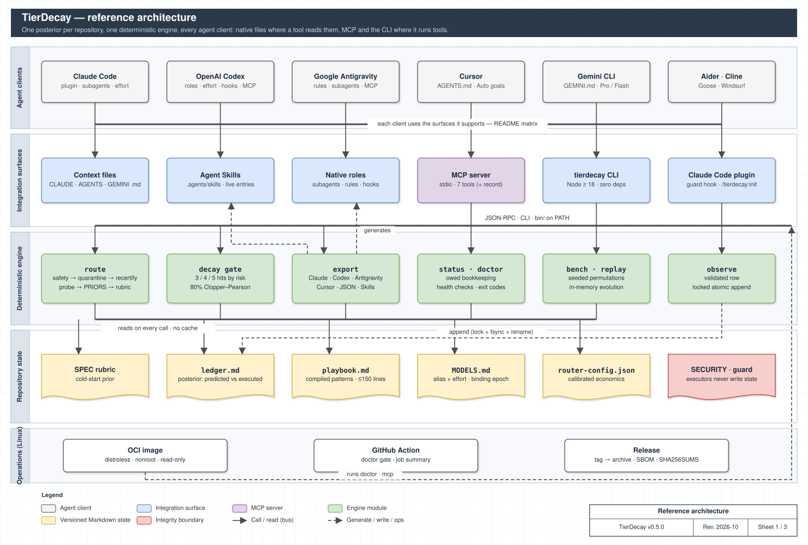
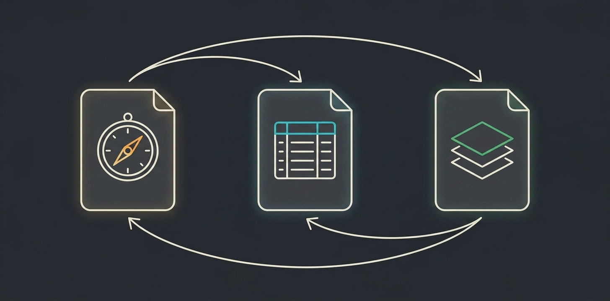
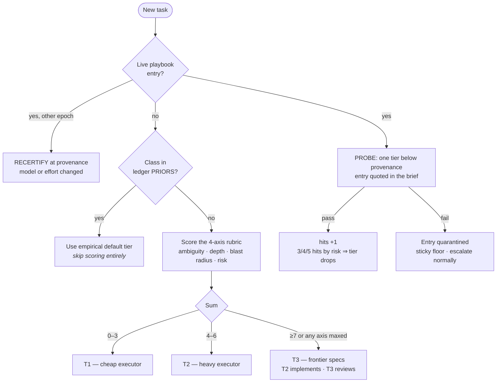
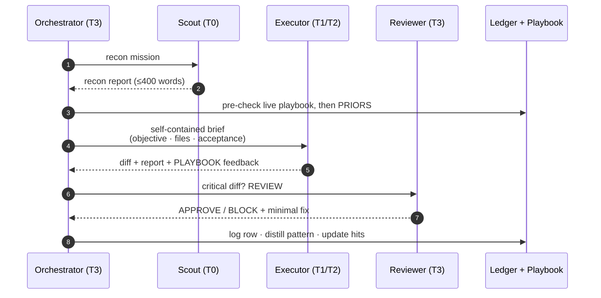
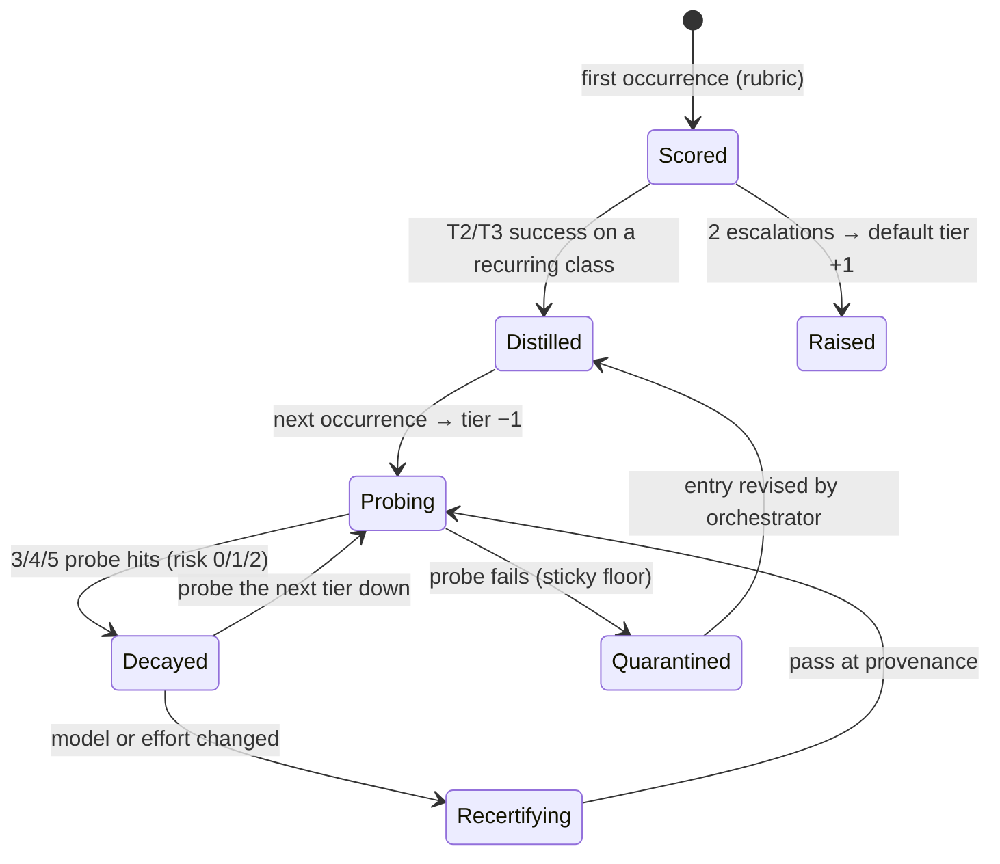
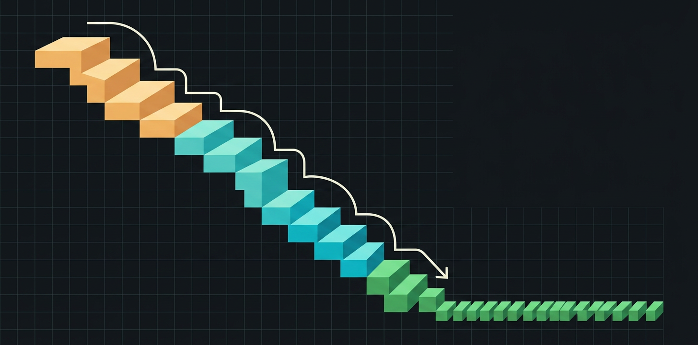
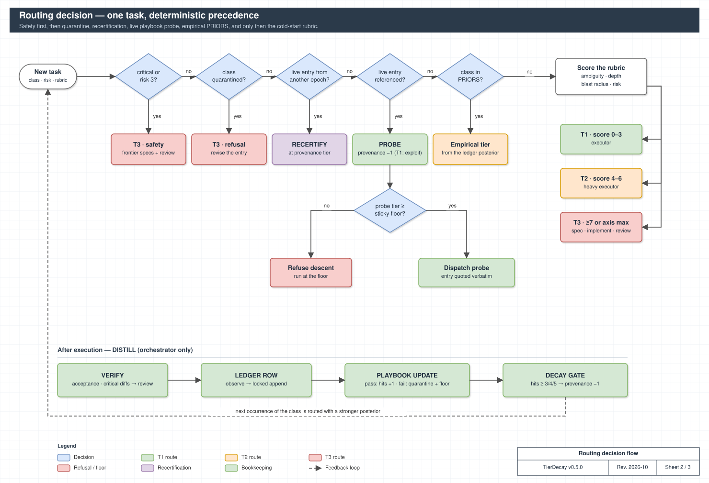
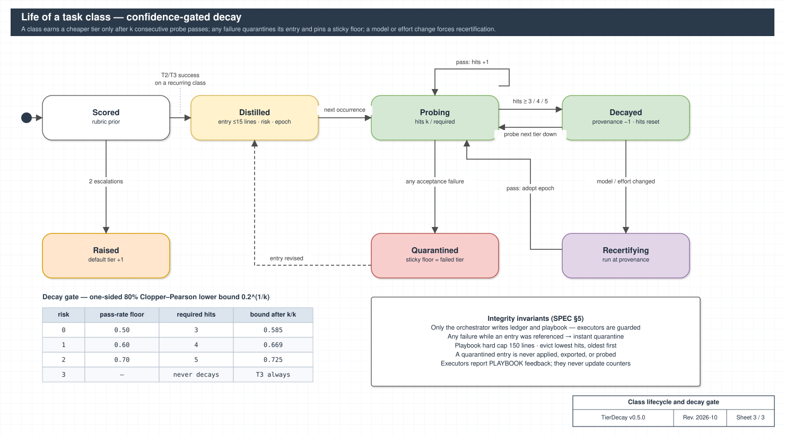

<div align="center">


# TierDecay

**The per-repo learning layer for AI coding model routers. It learns which of *your* recurring task classes can safely run on a cheaper tier — and hands that to the router you already use.**

*Native routers decide from population-wide signals. TierDecay adds the one signal they cannot see: your repo's own history of what passed where. One posterior, one deterministic engine, every agent: Claude Code, Codex, Antigravity, Cursor, Gemini CLI, and any MCP client.*

[](LICENSE)
[](CONTRIBUTING.md)
[](#how-it-works)
[](https://github.com/alebgl77/tierdecay/actions/workflows/ci.yml)
[](https://github.com/alebgl77/tierdecay/releases/latest)
[](https://github.com/alebgl77/tierdecay/stargazers)
<br/>
[](#deterministic-engine-cli-and-mcp-server)
[](docs/PRODUCTION.md)
[](action.yml)
[](docs/PRODUCTION.md#6-upgrades-and-supply-chain)
<br/>


<br/>


</div>

---

## The problem

Model routing is now built in: Cursor's router picks a model per request,
Claude Code binds subagents to models and effort levels, Aider splits
architect and editor. These routers decide from the request text and from
signals pooled across every user. None of them remembers that *in your repo*
`add-migration-store` has passed on the fast tier five times in a row — or
that `fix-flaky-test-jest` failed there twice. On task 500 they know as little
about your repo as on task 1.

## Where TierDecay fits

| | Native router (Cursor Auto, Claude Code subagents, …) | TierDecay |
|---|---|---|
| Learns from | the request, pooled usage across users | your repo's ledger: predicted vs. executed tier per task class |
| Decides | which model serves this request | which **tier** a recurring class has earned, with what evidence |
| Safety | provider heuristics | quarantine on any failure, sticky floors, confidence-gated decay, recertification on model/effort change |
| Output | a model call | a routing table and Agent Skills **for** the native router (`tierdecay export`) |

TierDecay does not proxy or replace the router. It is three Markdown files, a
protocol, and an optional deterministic advisor that turns your history into
per-class routes the router can follow.

## One brain, every agent

<div align="center">

</div>

The same ledger and playbook drive every client; what changes is how each
tool is told. Where a tool has native subagents, TierDecay binds its tiers to
them; everywhere else it falls back to phases in one conversation.

| Client | Tier binding | Delegation | Shared skills | State-write guard | MCP advisor | Install |
|---|---|---|---|---|---|---|
| **Claude Code** | alias × effort (`opus`/`sonnet`, `low`→`xhigh`) | 4 subagents | ✅ | ✅ `PreToolUse` hook | ✅ `claude mcp add` | plugin or `install.sh claude` |
| **OpenAI Codex** | session model × `model_reasoning_effort` | 4 roles (`.codex/agents/`) | ✅ `.agents/skills/` | ✅ hook on `apply_patch`/`Bash` | ✅ `.codex/config.toml` | `install.sh codex` |
| **Google Antigravity** | `pro` / `flash` × Planning / Fast | 4 subagents (`.agents/agents/`) | ✅ `.agents/skills/` | protocol + VERIFY + `doctor` | ✅ `.agents/mcp_config.json` | `install.sh antigravity` |
| **Cursor** | Auto goals (Cost / Balance / Intelligence) | single agent | `export --format skills` | protocol + VERIFY | ✅ | `install.sh cursor` |
| **Gemini CLI** | Pro / Flash | single agent | — | protocol + VERIFY | ✅ | `install.sh gemini` |
| **Aider · Cline · Goose · Windsurf** | architect/editor, Plan/Act, planner, picker | phases | — | protocol + VERIFY | client-dependent | `install.sh <tool>` |
| **Any MCP client** | — | — | — | read-only by default | ✅ `tierdecay mcp` | `npm i -g github:alebgl77/tierdecay` |

"✅ MCP advisor" means the client can run a local stdio MCP server; TierDecay
speaks both the stateless `2026-07-28` protocol (`server/discover`,
per-request version) and the `initialize` handshake of `2025-11-25` and
earlier, so current and older clients connect without configuration.

## The idea

**Routing should learn from your repo.** TierDecay is three markdown files and
a protocol — no proxy, no daemon, no SDK:

| File | Role | Analogy |
|---|---|---|
| `SPEC` (rubric) | How to route a task you've never seen | Cold-start **prior** |
| `LEDGER` | Predicted vs. executed tier, per task class | Empirical **posterior** |
| `PLAYBOOK` | High-tier solutions compiled into low-tier instructions | **Compilation target** |

<div align="center">

</div>

When an expensive model solves a hard problem, the orchestrator distills the
*decisions* (invariants, ordering, the trap) into a ≤15-line playbook entry.
The next occurrence of that problem class is **probed one tier lower** with
the entry in context. Enough passing probes — 3, 4, or 5 depending on the
class's risk, the smallest counts that give 80% confidence in a 50/60/70% pass
rate — and the class's default tier drops. A model or effort change sends the
class back to re-certify. The router learns your repo's difficulty
distribution, and only as fast as the evidence allows.

## How it works

### Routing a task


```mermaid
flowchart TD
    A([New task]) --> B{Live playbook<br/>entry?}
    B -- "yes, other epoch" --> R[RECERTIFY at provenance<br/>model or effort changed]
    B -- yes --> E[PROBE: one tier below provenance<br/>entry quoted in the brief]
    B -- no --> D{Class in<br/>ledger PRIORS?}
    D -- yes --> C[Use empirical default tier<br/><i>skip scoring entirely</i>]
    D -- no --> F[Score the 4-axis rubric<br/>ambiguity · depth · blast radius · risk]
    F --> G{Sum}
    G -- "0–3" --> T1[T1 — cheap executor]
    G -- "4–6" --> T2[T2 — heavy executor]
    G -- "≥7 or any axis maxed" --> T3[T3 — frontier specs<br/>T2 implements · T3 reviews]
    E -- pass --> H[hits +1<br/>3/4/5 hits by risk ⇒ tier drops]
    E -- fail --> I[Entry quarantined<br/>sticky floor · escalate normally]
```

### One task, end to end


```mermaid
sequenceDiagram
    autonumber
    participant O as Orchestrator (T3)
    participant S as Scout (T0)
    participant E as Executor (T1/T2)
    participant R as Reviewer (T3)
    participant L as Ledger + Playbook
    O->>S: recon mission
    S-->>O: recon report (≤400 words)
    O->>L: pre-check live playbook, then PRIORS
    O->>E: self-contained brief<br/>(objective · files · acceptance)
    E-->>O: diff + report + PLAYBOOK feedback
    O->>R: critical diff? REVIEW
    R-->>O: APPROVE / BLOCK + minimal fix
    O->>L: log row · distill pattern · update hits
```

### Life of a problem class


```mermaid
stateDiagram-v2
    [*] --> Scored: first occurrence (rubric)
    Scored --> Distilled: T2/T3 success on a recurring class
    Distilled --> Probing: next occurrence → tier −1
    Probing --> Decayed: 3/4/5 probe hits (risk 0/1/2)
    Probing --> Quarantined: probe fails (sticky floor)
    Decayed --> Probing: probe the next tier down
    Quarantined --> Distilled: entry revised by orchestrator
    Scored --> Raised: 2 escalations → default tier +1
    Decayed --> Recertifying: model or effort changed
    Recertifying --> Probing: pass at provenance
```

## The economics

Let `n ≥ 0` be the number of future reuses after the initial high-tier solve,
`C_hi ≥ 0` the fully loaded cost of one occurrence routed at the high tier,
`C_lo ≥ 0` the expected fully loaded cost of one reuse attempt beginning at the
low tier (including routing, verification, failures, and escalations), and
`C_distill ≥ 0` the one-time distillation cost after the initial solve. All
costs must use the same units.

```
static routing:   S(n) = (n + 1) · C_hi
tier decay:       T(n) = C_hi + C_distill + n · C_lo
cost gap:         Δ = C_hi - C_lo
```

For `Δ > 0`, weak break-even (`T(n) ≤ S(n)`) occurs at
`n ≥ ceil(C_distill / Δ)`; strict savings (`T(n) < S(n)`) occur at
`n ≥ floor(C_distill / Δ) + 1`. Equality occurs only when
`C_distill / Δ` is an integer (at that value of `n`); otherwise the weak
threshold already yields strict savings. Strict savings are impossible when
`Δ ≤ 0`. If `Δ < 0`, weak break-even is equality and occurs only at `n = 0`
when `C_distill = 0`. If `Δ = 0`, equality holds for every `n` when
`C_distill = 0`; otherwise there is no weak break-even.

### Measured: pilot v1

[`benchmarks/pilot-v1`](benchmarks/pilot-v1/RESULTS.md) ran 36 real executor
tasks (Opus and Sonnet) on a controlled fixture with hidden acceptance tests:
three recurring classes, three instances each.

| Route | Accepted | Cost per task (warm cache) |
|---|---|---|
| always frontier (`opus`) | 9 / 9 | 0.180 USD |
| always fast tier (`sonnet`) | 15 / 15 | 0.117 USD |
| TierDecay probe (`sonnet` + distilled entry) | 12 / 12 | 0.111 USD |

The fast tier cost **0.66×** the frontier per task (95% interval 0.63–0.69) at
equal acceptance. Replaying the protocol on those outcomes — first instance
routed by the rubric, later ones probed — saves **24%** against
always-frontier. The distilled entry itself added no significant saving over
a cold fast-tier attempt (0.97×, interval 0.90–1.05); 11 of 12 probes flagged
a step of it as inaccurate or inapplicable. Read: on classes the cheap tier can
already do, the value is the *routing*; the playbook matters where the cheap
tier fails without it — a regime this pilot did not reach. One fixture, small
n, one author: the [limitations](benchmarks/pilot-v1/RESULTS.md#limitations)
are spelled out.

### Illustration

Illustration only, not benchmark evidence: let `C_hi = 1`, `C_lo = 0.2`, and
`C_distill = 0.1`, and assume every low-tier probe succeeds without failure or
escalation cost.

| Occurrence | 1 *(initial)* | 2 *(first reuse)* | 3 | 4 | 5 |
|---|---|---|---|---|---|
| Static marginal | 1.0× | 1.0× | 1.0× | 1.0× | 1.0× |
| Static cumulative | 1.0× | 2.0× | 3.0× | 4.0× | 5.0× |
| **TierDecay marginal** | 1.1× *(solve+distill)* | 0.2× *(probe)* | 0.2× *(probe)* | 0.2× *(decayed)* | 0.2× |
| **TierDecay cumulative** | 1.1× | 1.3× | 1.5× | 1.7× | 1.9× |

Here `Δ = 0.8`, so both thresholds are `n ≥ 1`: the first reuse recovers the
overhead for this illustration only. Failures or escalations would raise the
realized cumulative cost above the table.

<div align="center">

</div>

Health metric: the `executed` column of your ledger should drift toward T1
over time for recurring classes. **That drift is the product.**

## Deterministic engine, CLI, and MCP server

An optional local Node.js engine reads the same Markdown ledger and playbook.
No runtime dependencies, network calls, daemon, clock, or random source. Its
only write path is a validated, locked, atomic ledger append.

```bash
tierdecay status                    # per class: route, hits vs. required, what the orchestrator owes
tierdecay doctor                    # health gate for CI: parse, cap, permissions, epochs; exit 1 on failure
tierdecay export --format codex     # routing table per client: claude | codex | antigravity | cursor | json
tierdecay export --format skills --out .agents/skills   # live entries as Agent Skills
tierdecay route --request request.json --policy shadow  # one decision, with the optimized recommendation
tierdecay observe --observation row.json --append .tierdecay/ledger.md   # lock · validate · fsync · rename
tierdecay bench --scenario outcomes.jsonl --config cfg.json --permutations 50   # order robustness
tierdecay mcp                       # the same logic as MCP tools over stdio (read-only by default)
```

(`node bin/tierdecay.js …` from a checkout; `npm install -g
github:alebgl77/tierdecay#v0.5.0` or the Claude Code plugin puts `tierdecay`
on the PATH.) The MCP server exposes `tierdecay_route`, `tierdecay_rubric`,
`tierdecay_playbook`, `tierdecay_status`, `tierdecay_export`,
`tierdecay_doctor`, and `tierdecay_validate_observation`;
`tierdecay_record` exists only with `--allow-ledger-append true`. `shadow`
keeps the protocol's decision effective;
`optimize` must be enabled explicitly with a calibrated economic configuration
and fails closed to T3 until its statistical cells have enough samples.
`bench` replays measured or hypothetical outcomes under seeded permutations
with in-memory playbook evolution, because self-improving systems are path
dependent and one replay order can flatter or hide a policy. See the
[router contract](core/ROUTER.md), [JSON schemas](core/schemas/), the
[pilot](benchmarks/pilot-v1/RESULTS.md), and the
[synthetic regression fixture](benchmarks/README.md). **No universal savings
claim.**

<details>
<summary><b>Engineering diagrams</b> — routing decision and decay lifecycle</summary>





Generated from [`scripts/build-diagrams.js`](scripts/build-diagrams.js); CI
fails if the SVGs drift from the generator.
</details>

## Running in production (Linux)

| Need | What ships |
|---|---|
| CI gate | [`action.yml`](action.yml): `uses: alebgl77/tierdecay@v0.5.0` runs `doctor`, writes a job summary, fails the step on any failing check |
| Containers | [`Dockerfile`](Dockerfile): distroless `nonroot`, base images pinned by digest, runs with `--read-only --network none` |
| Concurrency | ledger appends take an exclusive lock, re-validate, `fsync`, and rename; stale locks are broken after 30 s |
| Supply chain | releases are cut by CI from a tag on `main` after the full matrix passes; archive + CycloneDX SBOM + `SHA256SUMS` |
| Operations | stable exit codes, bash completion, canonical JSON output, no clock or randomness |

Full guide: [`docs/PRODUCTION.md`](docs/PRODUCTION.md).

## Why it doesn't rot

Self-modifying instruction systems have one canonical failure mode:
self-poisoning. TierDecay ships with the antibodies:

| Failure mode | Defense |
|---|---|
| Executor writes garbage into the playbook | Only the orchestrator writes config paths; VERIFY rejects any executor diff touching them — and the Claude Code adapter blocks it in-tool (guard hook + ask-gated writes) |
| A bad pattern silently spreads | Any acceptance failure while an entry was referenced → instant QUARANTINE |
| Playbook grows into context rot | Hard cap 150 lines; eviction = lowest hits, oldest first |
| Over-eager downgrading | Downgrade needs 3 / 4 / 5 consecutive probe passes by risk (80% Clopper–Pearson); risk-3 work never decays; a failed probe sets a **sticky floor** |
| A new model or effort level silently invalidates history | Entries carry their binding `epoch:`; a mismatch forces **recertification** at provenance before any further descent |
| A lucky task order flatters the router | `tierdecay bench` replays under seeded permutations and reports the spread |
| Over-eager distillation | One-offs are never distilled; "a wrong pattern costs more than no pattern" |
| Rubric drifts from reality | It can't — it's only the cold-start prior; the ledger posterior overrides it both directions |

## Quick start

**Claude Code — plugin (recommended):**

```text
/plugin marketplace add alebgl77/tierdecay
/plugin install tierdecay@tierdecay
/tierdecay:init          # in each project you opt in
```

See [`plugins/tierdecay`](plugins/tierdecay/README.md). Every other CLI — and
Claude Code without the plugin — uses the installer below.

For production, use only the
[latest tagged release](https://github.com/alebgl77/tierdecay/releases/latest).
`main` is unreleased development and is intended for evaluation and
contribution, not production use. Download both `tierdecay-<version>.tar.gz`
and `SHA256SUMS` from the release into the same directory, then verify the
archive before extracting or running its installer:

```bash
# Linux
sha256sum --check SHA256SUMS
# macOS
shasum -a 256 -c SHA256SUMS
tar -xzf tierdecay-<version>.tar.gz
```

Proceed only when the checksum command reports `OK`. Replace `<version>` below
with the release version you downloaded.

**Prerequisites:** one of the supported CLIs, and `bash` to run the installer —
already present on macOS and Linux; on **Windows** use Git Bash or WSL. No
service runtime, package manager, or API key is required. The Claude Code
adapter requires `node` for its local state-write guard hook. The optional
router requires Node.js 18+ for every adapter; the Markdown protocol itself
does not. Nothing is installed globally: the installer only copies files into
the repo you point it at.

```bash
cd your-project        # the repo you want to equip — NOT the tierdecay checkout
/path/to/tierdecay-<version>/install.sh auto
# or pick one explicitly:
/path/to/tierdecay-<version>/install.sh <claude|codex|antigravity|agents|cursor|gemini|aider|cline|goose|windsurf>
# preview without writing: /path/to/tierdecay-<version>/install.sh --dry-run <target>
```

Prefer the installer: an adapter-directory copy alone is incomplete. Manual
installs must also copy `core/MODELS.md` to `.tierdecay/MODELS.md`; non-native
adapters additionally need `core/SPEC.md` as `.tierdecay/PROTOCOL.md` and the
ledger/playbook templates as `.tierdecay/ledger.md` and `.tierdecay/playbook.md`.
Merge with existing files without overwriting learned state or permissions.
See the [native install and upgrade guide](adapters/claude-code/README.md).

<details>
<summary><b>Claude Code</b> (native — full 4-agent pipeline)</summary>

Copies `CLAUDE.md` + `.claude/` (4 subagents, 4 skills, the state-write guard
hook, ledger) to your repo root, plus `.tierdecay/MODELS.md`. Four roles use
two aliases separated by effort: `opus` for the main thread, oracle (`xhigh`),
and heavy executor (`high`); `sonnet` for the executor (`medium`) and scout
(`low`). No tier uses the cheapest model family — by policy. Check model access
in your client. The playbook is **preloaded** into both executors via the
`skills:` frontmatter. Same content as the plugin, as copied files. See
[`adapters/claude-code/`](adapters/claude-code/)
and [`core/MODELS.md`](core/MODELS.md) for the current policy.
</details>

<details>
<summary><b>OpenAI Codex</b> (native — 4 roles, effort tiers, guard hook, MCP)</summary>

Copies `AGENTS.md`, `.codex/` (four roles in `.codex/agents/` bound by
`model_reasoning_effort` `xhigh`/`high`/`medium`/`low` with matching sandboxes,
the MCP advisor in `config.toml`, a `PreToolUse` guard on `apply_patch` and
`Bash` scoped to executor roles), and the shared Agent Skills to
`.agents/skills/`. Trust the project, then approve the hook with `/hooks`.
See [`adapters/codex/`](adapters/codex/).
</details>

<details>
<summary><b>Google Antigravity</b> (native — always-on rule, 4 subagents, MCP)</summary>

Copies an always-on workspace rule, four subagents in `.agents/agents/`
(`pro` for T3/T2, `flash` for T1/T0, executors sandboxed), the shared Agent
Skills, and `.agents/mcp_config.json`. See
[`adapters/antigravity/`](adapters/antigravity/).
</details>

<details>
<summary><b>OpenCode · Copilot · Zed · any AGENTS.md reader</b> (AGENTS.md)</summary>

One `AGENTS.md` speaks to every CLI that adopted the standard. Single-agent
mode: phases replace subagents, model switching via your CLI's mechanism
(profiles, `/model`, per-agent config). See
[`adapters/agents-md/`](adapters/agents-md/).
</details>

<details>
<summary><b>Gemini CLI</b> (GEMINI.md)</summary>

Pro tier = T2/T3, Flash tier = T1/T0. See
[`adapters/gemini-cli/`](adapters/gemini-cli/).
</details>

<details>
<summary><b>Aider</b> (architect/editor — a natural fit)</summary>

Aider's `--architect` mode *is* a two-tier router. TierDecay adds the ledger,
the playbook, and the decay rules on top. See
[`adapters/aider/`](adapters/aider/).
</details>

<details>
<summary><b>Cline · Goose · Windsurf · Cursor</b> (AGENTS.md + native model binding)</summary>

Each ships an `AGENTS.md` these tools read natively, mapped to their own model
controls: **Cline** binds T3 → Plan-mode model, T1 → Act-mode model;
**Goose** binds T3 → the `/plan` planner model, T1/T2 → the default
`GOOSE_MODEL`; **Windsurf** runs single-agent phase mode via its per-message
model picker; **Cursor** reads `AGENTS.md` natively (root + nested) and maps
tiers onto its router's Auto goals (T1 → Cost, T2 → Balance, T3 →
Intelligence) or an explicit model pick (or a Project Rule at
`.cursor/rules/tierdecay.mdc`); `tierdecay export --format cursor` prints the
table. See [`adapters/cline/`](adapters/cline/),
[`adapters/goose/`](adapters/goose/), [`adapters/windsurf/`](adapters/windsurf/),
[`adapters/cursor/`](adapters/cursor/).
</details>

## What TierDecay is not

- **Not a proxy, a router daemon, or a competitor to your CLI's router.** Zero
  infrastructure. It's markdown, a protocol, and your CLI's own model-binding
  features — fed with a posterior they don't have.
- **Not a benchmark press release.** One small pilot, with its limits stated.
  Post your real decay curves — your ledger is the benchmark that matters.
- **Not model-locked.** Tiers are roles. Map them to whatever frontier /
  mid / fast models your provider ships this month.

## FAQ

**My CLI can't switch models mid-session.** A playbook hit can still reduce
turns, retries, and context — even on a single model. Tier-pricing savings
require tier binding and depend on the fully loaded costs above.

**What counts as a "class"?** A 2–4 token signature, `verb-object-surface`
(`add-endpoint-rest`, `write-migration-postgres`). Signature discipline is
what makes the posterior converge — the SPEC covers it.

**Can the cheap model corrupt the system?** Defense in depth, not an
impossibility claim. The protocol makes state orchestrator-only and VERIFY
rejects executor diffs touching it; the Claude Code adapter also enforces it
at the tool layer — executors carry a `PreToolUse` guard hook that checks target
paths and observable shell references, and the shipped `settings.json` asks
before built-in file-edit tools touch those directories. Dynamically constructed Bash
paths remain outside that permission rule and the hook's literal matching, so
everything an executor runs is still judged against acceptance criteria it
didn't author. Residual risk and threat model: [SECURITY.md](SECURITY.md).

**Is this fine-tuning?** No weights change. It's *in-context distillation*:
expensive reasoning compiled into instructions a cheaper model can follow.

**Why is no tier bound to the cheapest model family?** Deliberate policy: the
cheap end of the ladder is the fast workhorse at lower effort. Effort is a cost
lever inside one model, one family per role keeps prompt caches and the
posterior interpretable, and the executor tiers keep quality headroom. A test
fails if any shipped binding drifts from it — see
[`core/MODELS.md`](core/MODELS.md).

**I already use Cursor's Auto / Claude Code's subagents. Why add this?** They
choose per request from pooled signals. TierDecay remembers, per class, what
actually passed in *your* repo, refuses to descend without evidence, and
re-certifies when models change — then exports that as a table or as Agent
Skills for the router you already use.

## Versions and roadmap

| Version | Date | Highlights |
|---|---|---|
| **0.5.0** | 2026-10-01 | Codex and Antigravity native adapters, shared Agent Skills, MCP server (2026-07-28 + legacy), `doctor`, locked ledger append, OCI image, GitHub Action, SBOM, automated tagged releases, engineering diagrams |
| 0.4.0 | 2026-10-01 | Real-model pilot (36 graded runs), confidence-gated decay, recertification, effort axis, Claude Code plugin |
| 0.3.0 | 2026-09-26 | Deterministic zero-dependency router: shadow/optimize, bounded statistics, sequential replay |
| 0.2.1 | 2026-09-03 | Four roles on two aliases, cross-OS regressions, release readiness gate |
| 0.2.0 | 2026-09-03 | Cline, Goose, Windsurf, Cursor adapters; executor guard; dry-run and uninstall |
| 0.1.0 | 2026-07-12 | Protocol, rubric, ledger, playbook, first adapters, installer |

Every change: [`CHANGELOG.md`](CHANGELOG.md). Next — pilot v2 on classes the
fast tier fails cold, team ledger merge, OpenTelemetry GenAI export,
calibration, stable 1.0 contracts: [`ROADMAP.md`](ROADMAP.md).

## Contributing

Adapters wanted: Qwen Code, Amp, Continue, Kiro. One folder, one
context file, one README — see [CONTRIBUTING.md](CONTRIBUTING.md).

---

<div align="center">

**If your ledger drifted toward the cheap tier this week, TierDecay did its job.**

</div>
